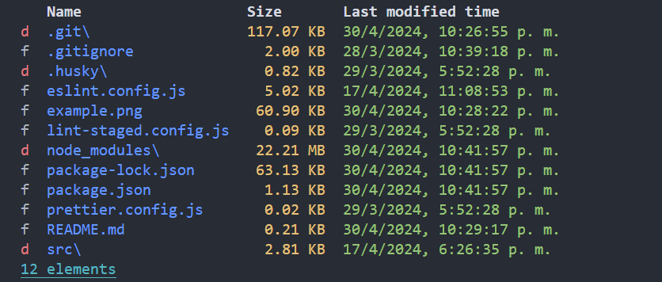

# node-files-app

🗃 Simple node app that can list and display information about files and directories for a given path

## How to install

run `npm i` command

## How to use

run `npm start [<path>]`

